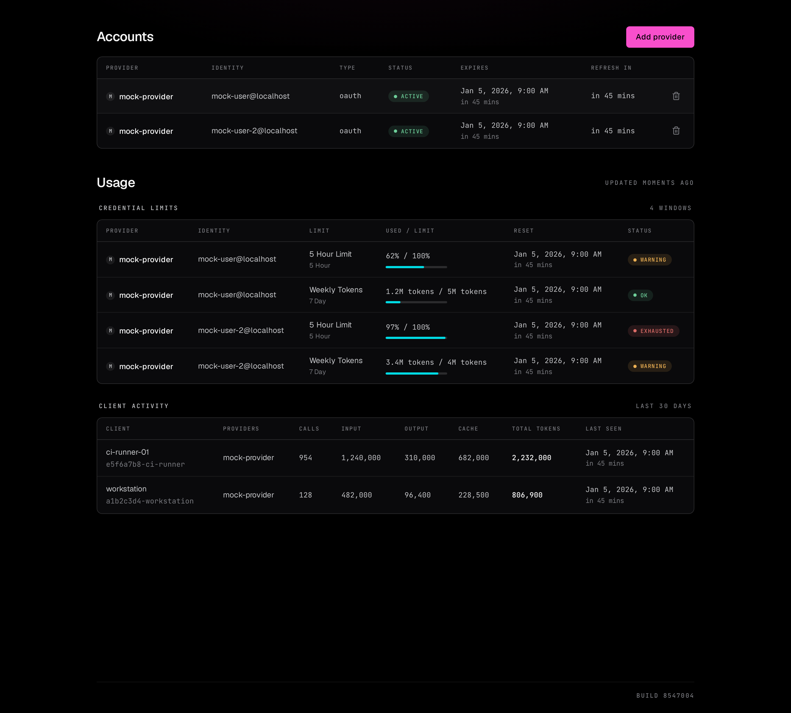
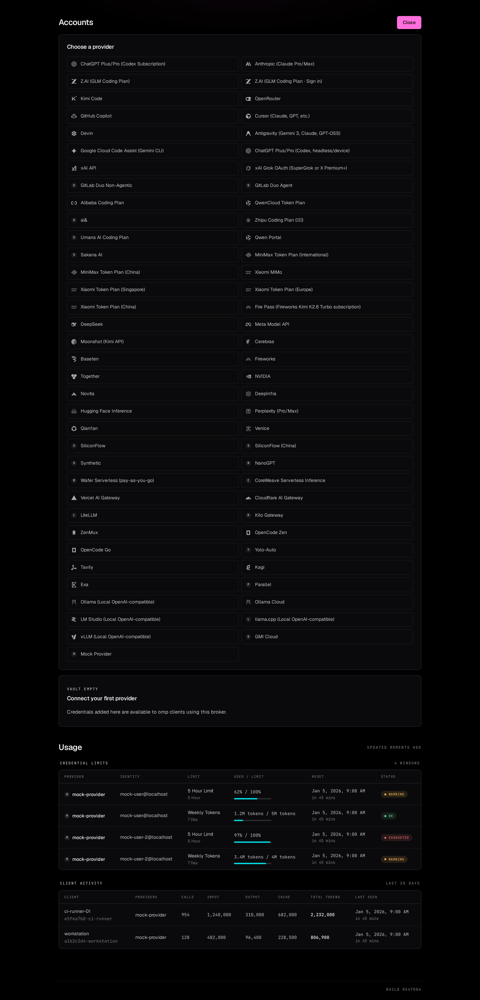

> ⚠️ **100% vibecoded codebase**

# omp-auth-broker

`omp-auth-broker` is a lightweight, self-hostable version of omp's auth broker. Run the shared OAuth credential vault, the `/v1` broker API, and a web UI without installing the full omp binary.

## Security

> [!CAUTION]
> 🛑 **There is no application authentication on any route.** Network reachability is the only gate: use loopback or Tailscale. Do not expose this service directly to a public network.

Anyone who can reach the service can use the UI, `/api/*`, and `/v1/*`. Cross-site requests to `/api/*` receive `403`, and requests without a JSON content type receive `415`. Those checks are CSRF hardening, not authentication.

## Web UI and vault

Open the server root to manage the shared vault. The UI lists accounts, starts provider OAuth login, removes credentials, and shows account status and expiry. The Usage section reports per-credential provider limits and per-client request and token totals for the last 30 days.



Add provider opens a picker listing every registered OAuth provider. OAuth login is available only through the UI's `/api/login`, never through `/v1`.

<details>
<summary>Add provider screenshot</summary>



</details>

The vault is omp's own credential database at `~/.omp/agent/agent.db`. `/v1/*` is transparently proxied to an in-process upstream broker.

## CLI

```sh
omp-auth-broker serve --settings=/etc/omp-auth-broker/settings.json
omp-auth-broker token
```

`serve` starts the broker on `127.0.0.1`, port `8765` by default. The listen address is always loopback and cannot be changed; `--settings=<path>` reads a JSON settings file that sets the port and the allowed external hostname. Reach the broker from other machines through Tailscale or another gateway that restricts who can connect, never by binding a public interface.

Settings file keys:

```json
{ "port": 8765, "hostname": "broker.your-tailnet.ts.net" }
```

`hostname` is the external name allowed in the `Host` header. Loopback names are always allowed; anything else is refused with `421`. This blocks DNS rebinding, where a hostname an attacker controls resolves to your bind address so their page becomes same-origin. It is not authentication.

`token` exists because some omp clients insist on setting a token. This broker does not validate it.

## Development

```sh
bun install
bun run dev
bun run check
bun run lint
bun run format
bun run test
```

`bun run dev` reads your existing `~/.omp/agent/agent.db`, so the accounts you already authorised in omp show up immediately and stay usable from the CLI — no import or copy step. Both processes talk to the same SQLite file, so log in or remove a provider from either side and the other sees it.

To leave that vault untouched, point the broker at a throwaway one:

```sh
PI_CONFIG_DIR=/tmp/omp-broker-dev bun run dev
```

`bun run test` needs `CHROME_BIN`; the devenv shell exports it automatically.

## Nix

```sh
nix build
./result/bin/omp-auth-broker serve
nix build .#screenshots
nix flake check --no-pure-eval
devenv test
```

`nix flake check --no-pure-eval` builds and runs the full browser e2e suite inside the Nix sandbox (`checks.e2e`) — no host network, no ambient toolchain. `nix build .#screenshots` runs only the screenshot capture in that same sandbox and writes `overview.png`/`add-provider.png` to `result/`; CI copies them back into `docs/screenshots`. Both commands exercise the identical hermetic environment locally and in CI.

The Nix dependency closure is derived from `bun.lock` automatically. There is no hash to regenerate when dependencies change. This uses import-from-derivation (IFD), so IFD must be allowed.

## NixOS module

Import `nixosModules.default` from the flake. The module has exactly four options:

```nix
services.omp-auth-broker = {
  enable = true;
  package = omp-auth-broker.packages.${pkgs.stdenv.hostPlatform.system}.default;
  dataDir = "/var/lib/omp-auth-broker";
  settings = {
    port = 8765;
    hostname = "broker.your-tailnet.ts.net";
  };
};
```

`settings` is rendered to a JSON file and passed to `serve --settings`; it is freeform, so keys beyond `port` and `hostname` pass through. `settings.port` defaults to `8765` and `settings.hostname` defaults to `null`. `dataDir` defaults to `/var/lib/omp-auth-broker` and sets `PI_CONFIG_DIR`. The service always binds to `127.0.0.1` and never opens a firewall. It runs as a hardened systemd `DynamicUser`.
