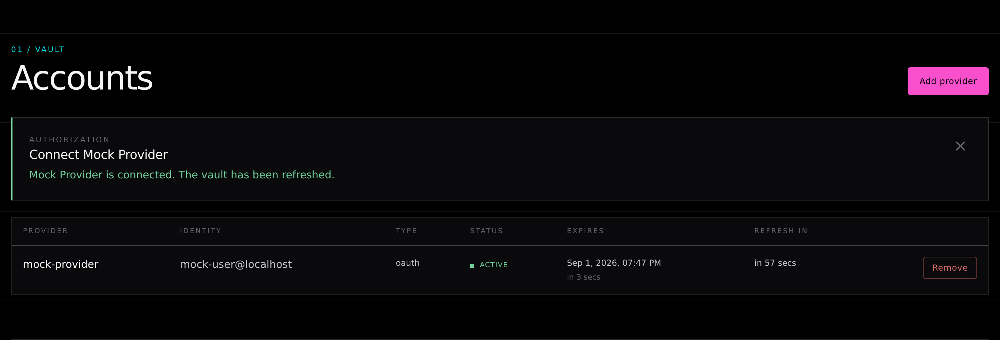
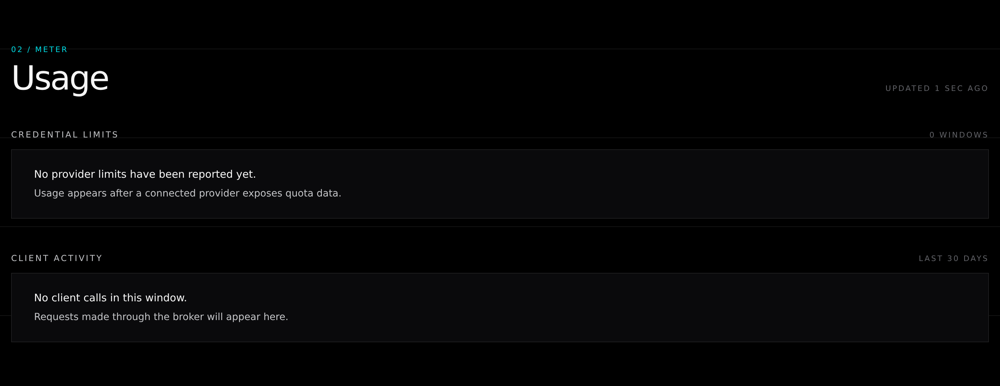

> ⚠️ **100% vibecoded codebase**

# omp-auth-broker

`omp-auth-broker` is a lightweight, self-hostable version of omp's auth broker. Run the shared OAuth credential vault, the `/v1` broker API, and a web UI without installing the full omp binary.

## Security

**There is no application authentication on any route.** Network reachability is the only gate: use loopback or Tailscale. Do not expose this service directly to a public network.

Anyone who can reach the service can use the UI, `/api/*`, and `/v1/*`. Cross-site requests to `/api/*` receive `403`, and requests without a JSON content type receive `415`. Those checks are CSRF hardening, not authentication.

## Web UI and vault

Open the server root to manage the shared vault. The UI lists accounts, starts provider OAuth login, removes credentials, and shows account status and expiry. OAuth login is available only through the UI's `/api/login`, never through `/v1`.



The Usage section reports per-credential provider limits and per-client request and token totals for the last 30 days.



The vault is omp's `~/.omp/agent.db`. Set `PI_CONFIG_DIR` before starting the broker to use an isolated vault. `/v1/*` is transparently proxied to an in-process upstream broker.

## CLI

```sh
omp-auth-broker serve --bind=127.0.0.1:8765
omp-auth-broker token
```

`serve` starts the broker and accepts `--bind=<host:port>`. Keep the bind address on loopback unless Tailscale limits who can reach it.

`token` exists because some omp clients insist on setting a token. This broker does not validate it.

## Development

```sh
bun install
bun run dev -- --bind=127.0.0.1:8765
bun run check
bun run lint
bun run format
bun run test
```

## Nix

```sh
nix build
./result/bin/omp-auth-broker serve --bind=127.0.0.1:8765
nix flake check --impure
devenv test
```

The Nix dependency closure is derived from `bun.lock` automatically. There is no hash to regenerate when dependencies change. This uses import-from-derivation (IFD), so IFD must be allowed.

## NixOS module

Import `nixosModules.default` from the flake. The module has exactly four options:

```nix
services.omp-auth-broker = {
  enable = true;
  package = omp-auth-broker.packages.${pkgs.stdenv.hostPlatform.system}.default;
  port = 8765;
  dataDir = "/var/lib/omp-auth-broker";
};
```

`port` defaults to `8765`; `dataDir` defaults to `/var/lib/omp-auth-broker` and sets `PI_CONFIG_DIR`. The service always binds to `127.0.0.1` and never opens a firewall. It runs as a hardened systemd `DynamicUser`.
